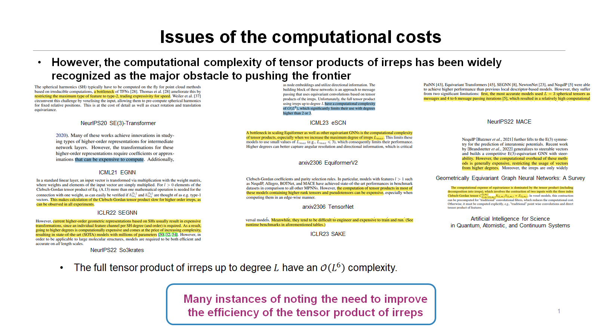
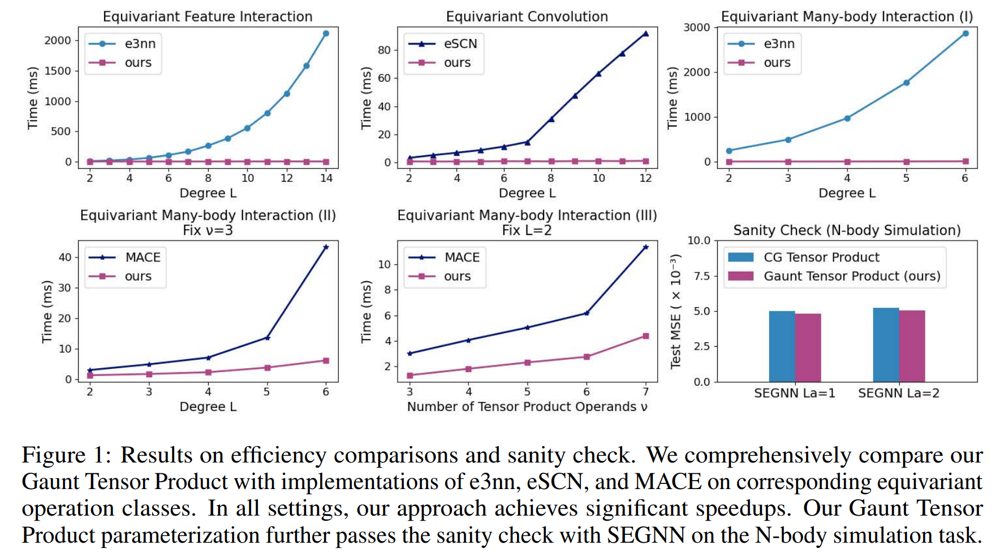
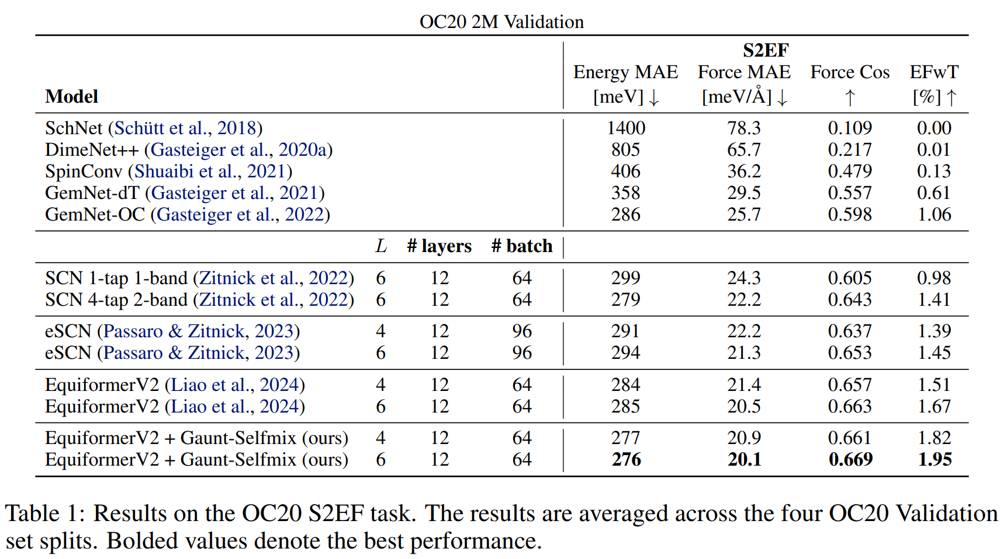
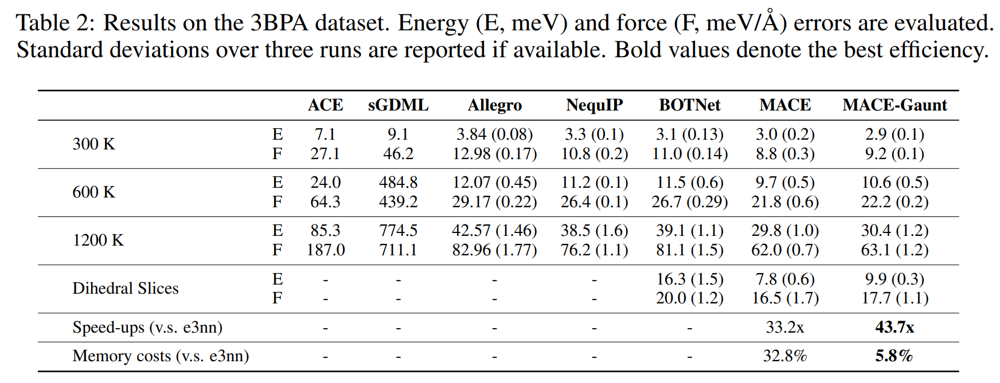

# Gaunt-Tensor-Product

This repo is the official implementation of ICLR 2024 Spotlight Presentation: [Enabling Efficient Equivariant Operations in the Fourier Basis via Gaunt Tensor Products](https://arxiv.org/abs/2401.10216). 

> Enabling Efficient Equivariant Operations in the Fourier Basis via Gaunt Tensor Products
>
> [Shengjie Luo*](https://lsj2408.github.io), [Tianlang Chen*](https://scholar.google.com/citations?user=x65kfVEAAAAJ), [Aditi S. Krishnapriyan](https://a1k12.github.io/)
> 
> Contact: Shengjie Luo (luosj@stu.pku.edu.cn), Tianlang Chen (tlchen@pku.edu.cn), Aditi S. Krishnapriyan (aditik1@berkeley.edu)

## News
- [24-01-19] 👀 Our paper is updated on [arXiv](https://arxiv.org/abs/2401.10216).
- [24-01-15] 🔥 Our work is accepted at [ICLR 2024](https://openreview.net/forum?id=mhyQXJ6JsK&noteId=Ns2MkZwbUx) as a <font color='red'>**Spotlight**</font> presentation!

## Contents
- [Todo](https://github.com/lsj2408/Gaunt-Tensor-Product#todo)
- [Introduction](https://github.com/lsj2408/Gaunt-Tensor-Product#introduction)
- [Main Results](https://github.com/lsj2408/Gaunt-Tensor-Product#main-results)
- [Quick Start](https://github.com/lsj2408/Gaunt-Tensor-Product#quick-start)
- [Citation](https://github.com/lsj2408/Gaunt-Tensor-Product#citation)
- [Acknowledgments](https://github.com/lsj2408/Gaunt-Tensor-Product#acknowledgments)

## TODO

- [x] Release the arXiv version.
- [ ] Release the code of efficiency comparison.
- [ ] Clean up and release the code of force field modeling.

## Introduction
Developing equivariant neural networks for the E(3) group plays an important role in modeling 3D data across real-world applications. Enforcing this equivariance primarily involves the tensor products of irreducible representations (irreps). However, the computational complexity of such operations increases significantly as higher-order tensors are used. 
<div align="center">
  
</div>

In this work, we propose a systematic approach to substantially accelerate the computation of the tensor products of irreps. We mathematically connect the commonly used Clebsch-Gordan coefficients to the Gaunt coefficients, which are integrals of products of three spherical harmonics. Through Gaunt coefficients, the tensor product of irreps becomes equivalent to the multiplication between spherical functions represented by spherical harmonics. This perspective further allows us to change the basis for the equivariant operations from spherical harmonics to a 2D Fourier basis. Consequently, the multiplication between spherical functions represented by a 2D Fourier basis can be efficiently computed via the convolution theorem and Fast Fourier Transforms. This transformation reduces the complexity of full tensor products of irreps **from O(L^6) to O(L^3)**, where L is the max degree of irreps.

Building upon this approach, we introduce the Gaunt Tensor Product, which serves as a new method for efficient equivariant operations across various model designs. We provide a comprehensive study on major operation classes that are widely used in equivariant models for the Euclidean group, demonstrating the generality of our method and how it can be used to design efficient operations:
- Equivariant Feature Interactions:
  - PhiSNet: [Paper](https://arxiv.org/abs/2106.02347)
  - So3krates: [Paper](https://arxiv.org/abs/2205.14276) & [Code](https://github.com/thorben-frank/mlff)
  - QHNet: [Paper](https://arxiv.org/abs/2306.04922) & [Code](https://github.com/divelab/AIRS/tree/main/OpenDFT/QHNet)
- Equivariant Convolutions:
  - TFN: [Paper](https://arxiv.org/abs/1802.08219) & [Code](https://github.com/tensorfieldnetworks/tensorfieldnetworks)
  - SE(3)-Transformer: [Paper](https://arxiv.org/abs/2006.10503) & [Code](https://github.com/FabianFuchsML/se3-transformer-public)
  - NequIP: [Paper](https://www.nature.com/articles/s41467-022-29939-5) & [Code](https://github.com/mir-group/nequip)
  - SEGNN: [Paper](https://arxiv.org/abs/2110.02905) & [Code](https://github.com/RobDHess/Steerable-E3-GNN)
  - eSCN: [Paper](https://arxiv.org/abs/2302.03655) & [Code](https://github.com/Open-Catalyst-Project/ocp)
  - Equiformer: [Paper](https://arxiv.org/abs/2206.11990) & [Code](https://github.com/atomicarchitects/equiformer)
  - EquiformerV2: [Paper](https://arxiv.org/abs/2306.12059) & [Code](https://github.com/atomicarchitects/equiformer_v2)
- Equivariant Many-Body Interactions: 
  - MACE: [Paper](https://arxiv.org/abs/2206.07697) & [Code](https://github.com/ACEsuit/mace)
  - BOTNet: [Paper](https://arxiv.org/abs/2205.06643)
## Main results
### Efficiency Comparison

<div align="center">
  
</div>


### Force Field Modeling -- Open Catalyst Project
<div align="center">
  
</div>

### Force Field Modeling -- 3BPA
<div align="center">
  
</div>

## Quick Start
- TODO: Please stay tuned.
  
## Citation
If you find this work useful, please kindly consider citing our work:
```
@misc{luo2024enabling,
      title={Enabling Efficient Equivariant Operations in the Fourier Basis via Gaunt Tensor Products}, 
      author={Shengjie Luo and Tianlang Chen and Aditi S. Krishnapriyan},
      year={2024},
      eprint={2401.10216},
      archivePrefix={arXiv},
      primaryClass={cs.LG}
}
```
## Acknowledgments
We would like to thank the following open source efforts for pushing the boundary of equivariant networks for the Euclidean group:
* [e3nn](https://github.com/e3nn/e3nn)
* [e3nn-jax](https://github.com/e3nn/e3nn-jax)
* [EquiformerV2](https://github.com/atomicarchitects/equiformer_v2)
* [MACE](https://github.com/ACEsuit/mace)
